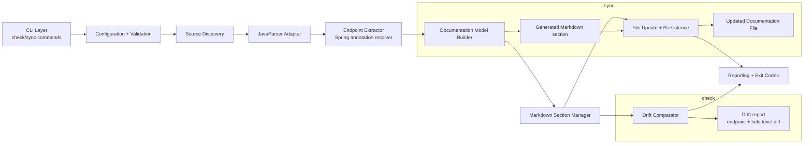

# Architecture: DocGuard

## 1. Purpose and architectural intent

DocGuard is a Java 17 Maven CLI that statically analyzes Spring Boot REST controller source code, derives the effective API surface, generates a Markdown documentation fragment, and compares it with the existing generated section in a Markdown file.

The design follows a simple, deterministic pipeline:

- Discover Java source files
- Parse Spring controller classes using JavaParser
- Extract endpoint metadata from annotations and signatures
- Generate stable Markdown output
- Compare generated output with the existing generated section
- Either report drift (`check`) or rewrite the generated section (`sync`)

The architecture is intentionally conservative: it prefers static analysis, explicit diagnostics, and safe file handling over runtime inspection or speculative behavior.

## 2. High-level architecture

### 2.1 Main components

1. CLI Layer
   - Entry point for commands and command-line arguments
   - Validates inputs and orchestrates the execution flow
   - Produces exit codes and human-readable diagnostics

2. Configuration and Validation
   - Resolves source directory, documentation file, and global options
   - Validates required paths and content assumptions before processing
   - Enforces safety rules such as refusing to overwrite when markers are malformed

3. Source Discovery
   - Recursively scans the configured source tree
   - Selects Java files relevant to Spring REST controllers
   - Filters out non-controller files early to reduce parsing work

4. Java AST Parser Adapter
   - Uses JavaParser to parse Java source into an AST
   - Resolves annotations, class-level mappings, and method signatures
   - Provides a clean abstraction over JavaParser details so domain logic remains independent of parser implementation details

5. Endpoint Extractor and Spring Resolver
   - Resolves controller classes and mapping annotations
   - Combines class-level and method-level `@RequestMapping` metadata
   - Extracts HTTP method, path, path variables, query params, request body, and response type
   - Produces a normalized internal model for each endpoint

6. Documentation Model Builder
   - Converts normalized endpoint metadata into a canonical internal representation
   - Ensures deterministic ordering and formatting
   - Produces a generated Markdown fragment and a comparable structured model

7. Markdown Section Manager
   - Locates the generated section using `<!-- GENERATED:START -->` and `<!-- GENERATED:END -->`
   - Preserves manual content outside the section
   - Handles missing, duplicate, or malformed markers according to strict validation rules

8. Drift Comparator
   - Compares generated output with the current generated section
   - Produces field-level and endpoint-level diffs
   - Supports both exact comparison and semantic comparison of endpoint properties

9. File Update and Persistence
   - Writes documentation updates safely via temporary-file + atomic replace pattern
   - Ensures that only the generated section changes
   - Prevents partial file writes and preserves the rest of the Markdown document

10. Reporting and Exit Code Layer
   - Formats user-facing output for `check` and `sync`
   - Maps operational outcomes to correct exit codes
   - Reports errors consistently to stderr/stdout as needed

## 3. Recommended technology and library choices

### 3.1 Java and Maven

- Java 17
- Maven as the build and dependency management tool

Why:
- Fits the requirement to work with Java source parsing and Spring projects
- Maintains predictable CI/CD integration
- Keeps the project simple for a first implementation with a single executable CLI

### 3.2 CLI framework

Recommended: Picocli

Why:
- Very good for small Java CLIs
- Easily supports subcommands (`check`, `sync`)
- Produces polished help text and structured validation
- Keeps the command surface simple and maintainable

### 3.3 Java parsing

Recommended: JavaParser

Why:
- Required by the requirements and clearly the best-fit choice
- Provides AST-based parsing instead of fragile regex heuristics
- Handles annotation extraction and method signatures accurately
- Suitable for static analysis of Spring controller code with minimal runtime dependency

Alternative considered: regex-only parsing
- Rejected because it is fragile, error-prone, and does not meet the accuracy and maintainability requirements

### 3.4 Logging and diagnostics

Recommended: SLF4J + Logback

Why:
- Standard Java logging stack
- Useful for verbose diagnostics in CI and local execution
- Supports structured error output while preserving clean CLI output

### 3.5 Testing

Recommended: JUnit 5 + AssertJ (or Hamcrest)

Why:
- Standard for Java projects
- Good fit for parser unit tests and end-to-end CLI tests
- Allows deterministic validation of edge cases such as malformed markers, empty source trees, and drift detection

### 3.6 Serialization / comparison helpers

Minimal additional dependencies are preferable.

Recommendation:
- Keep the internal representation as plain Java POJOs
- Use simple comparator logic for drift detection
- Avoid introducing heavy frameworks or model-generation tooling unless requirements expand

This keeps the solution compact and aligned to the initial architecture.

## 4. Component responsibilities

### 4.1 CLI Layer

Responsibilities:
- Parse command-line options
- Dispatch to `check` or `sync`
- Handle help/usage output
- Normalize and pass configuration into the processing pipeline

Key design rule:
- No business logic should live here beyond orchestration and validation

### 4.2 Configuration and Validation

Responsibilities:
- Ensure the source directory exists and is readable
- Ensure the documentation file exists in check mode and is present in sync mode when required by policy
- Confirm generated markers are correctly formed before write operations
- Validate arguments and fail fast with clear diagnostics

Key design rule:
- Fail before mutation whenever the tool cannot safely process the inputs

### 4.3 Source Discovery

Responsibilities:
- Find `.java` files recursively
- Filter for candidate controller files by scanning class declarations and annotation usage
- Ignore non-controller files efficiently to reduce parse cost

Key design rule:
- “Discovery first, deep parse second” is the optimization principle

### 4.4 Java AST Parser Adapter

Responsibilities:
- Parse each candidate Java file into an AST
- Expose methods to inspect:
  - package/class structure
  - annotations
  - methods
  - parameter annotations
  - return types

Key design rule:
- This component should isolate JavaParser from the rest of the system to prevent the architecture from becoming tightly coupled to a specific parser library

### 4.5 Endpoint Extractor and Spring Resolver

Responsibilities:
- Determine whether a class is a Spring controller
- Resolve full controller paths from class-level `@RequestMapping`
- Resolve method-level mapping metadata from `@GetMapping`, `@PostMapping`, etc.
- Merge path and method values correctly
- Extract endpoint metadata into a canonical domain model

Key design rule:
- Normalize all endpoint data into a consistent model before generating docs or comparing values

### 4.6 Documentation Model Builder

Responsibilities:
- Convert endpoint metadata into the representation to be rendered in Markdown
- Guarantee canonical ordering and stable formatting
- Build a secondary internal model used for diffing so output generation and comparison remain separated

Key design rule:
- Do not generate Markdown directly from raw AST nodes; generate from normalized data structures

### 4.7 Markdown Section Manager

Responsibilities:
- Locate generated-section boundaries in the existing Markdown
- Read and replace content between the markers without touching the rest of the file
- Validate structural integrity of the document

Key design rule:
- The generated section is the only writable region in sync mode

### 4.8 Drift Comparator

Responsibilities:
- Compare generated endpoint model vs. existing generated endpoint model
- Identify additions, removals, and changes
- Provide field-level diffs for method, path, path variables, query params, request body, and response type
- Produce a structured report suitable for CLI output

Key design rule:
- The comparison engine should operate on normalized data, not on raw text where possible

### 4.9 File Update and Persistence

Responsibilities:
- Replace the generated block atomically
- Preserve exact manual content outside the section
- Avoid partial writes and temporary corruption

Key design rule:
- Write to a temp file then replace the original using an atomic move when supported

### 4.10 Reporting and Exit Code Layer

Responsibilities:
- Print concise drift summaries for `check`
- Print success or error status for `sync`
- Return exit codes consistent with CI/CD expectations

Key design rule:
- The process must be deterministic and script-friendly

## 5. End-to-end data flow

### 5.1 Normal flow for check mode

1. User invokes CLI with `check` and required arguments.
2. CLI parses inputs and validates the source directory and doc file.
3. Source Discovery enumerates candidate Java files.
4. Parser Adapter reads each candidate file and builds ASTs.
5. Endpoint Extractor identifies controller classes and mapping annotations.
6. Domain model is produced for each endpoint with normalized method/path/parameter metadata.
7. Documentation Model Builder renders the canonical Markdown fragment.
8. Markdown Section Manager reads the existing generated section from the documentation file.
9. Drift Comparator compares the generated model with the existing generated section.
10. Reporting layer prints differences and exits with a non-zero status if drift is detected.

### 5.2 Normal flow for sync mode

1. User invokes CLI with `sync` and required arguments.
2. CLI validates arguments and safety constraints.
3. Source Discovery enumerates Java files.
4. Parser Adapter builds ASTs for candidate controller files.
5. Endpoint Extractor resolves all endpoints into normalized metadata.
6. Documentation Model Builder creates the fresh Markdown section.
7. Markdown Section Manager validates generated markers in the target file.
8. File Update and Persistence replaces only the generated section with the new content.
9. Reporting layer prints success/failure information and proper exit code.

### 5.3 Error flow

Errors occur before mutation whenever possible:

- missing source directory
- invalid Java source file
- malformed markers
- missing documentation file in `check`
- permission failures
- unreadable files or encoding issues

These are handled by the validation layer and reporting layer, with the mutation layer protected by guard checks.

## 6. Mermaid component and flow diagram



## 7. How check mode works

`check` mode is a read-only validation path.

Flow:
- Discover and parse all relevant Java source files
- Build normalized endpoint metadata
- Generate the expected Markdown fragment
- Read the current documentation file
- Extract the generated section from the file
- Compare the two representations
- Report differences and exit with a non-zero code if drift exists

Behavioral guarantees:
- No file modification occurs
- The process is deterministic and suitable for CI/CD
- Exit code semantics follow the requirement: `0` for synchronized docs, non-zero for drift and operational failures

Output expectations:
- Summary of added endpoints
- Summary of removed endpoints
- Summary of changed endpoints
- Field-level detail for method, path, query params, path variables, request body, and response type

## 8. How sync mode works

`sync` mode is the write path.

Flow:
- Same source parsing and endpoint extraction as `check`
- Generate a fresh Markdown section based on the current source code
- Read the existing documentation file
- Locate the generated section using markers
- Replace the content between markers while preserving all other Markdown content unchanged
- Write the file safely with atomic replacement semantics when possible

Behavioral guarantees:
- It only modifies the generated section, never manual content outside it
- It refuses to write if markers are malformed or missing in the safe, requirement-driven mode
- It preserves the rest of the file exactly for manual documentation

## 9. Architectural decisions and trade-offs

### Decision 1: Static analysis instead of runtime discovery

Chosen approach:
- Parse Java source code directly using JavaParser

Benefits:
- Works without starting Spring Boot
- Predictable and suitable for CI/CD
- Avoids environment and runtime complexity

Trade-off:
- It cannot detect runtime-generated endpoints or reflection-based configuration
- It is limited to what is statically visible in source code and annotation metadata

### Decision 2: AST parsing with JavaParser instead of regex

Benefits:
- Better annotation handling
- More robust for complex signatures and formatting variations
- More maintainable than parsing text with low-level pattern matching

Trade-off:
- More initial complexity
- Requires a parser library and careful modeling of Spring concepts

### Decision 3: Canonical internal model before rendering or comparison

Benefits:
- Determinism
- Cleaner comparison logic
- Better separation of concerns
- Easier testing of endpoint metadata independent of Markdown formatting

Trade-off:
- Requires one additional modeling layer
- Slightly more code than generating raw Markdown directly

### Decision 4: Generated-section markers as a safety boundary

Benefits:
- Manual documentation remains preserved
- Clear ownership of generated content
- Works well in documentation-heavy Markdown files

Trade-off:
- Requires the target documentation file to be structured a certain way
- The tool cannot safely auto-repair malformed marker layouts without explicit requirements for that behavior

### Decision 5: Fail-fast validation for unsafe operations

Benefits:
- Prevents accidental data loss
- Makes CI/CD behavior clear and trustworthy
- Keeps the project honest about what it can and cannot safely process

Trade-off:
- Some misuse scenarios fail before producing any output instead of attempting self-healing
- This is acceptable for the initial version because requirements emphasize safety and explicit failure handling

### Decision 6: Single CLI application with a focused modular structure

Benefits:
- Simpler build, packaging, and deployment
- Easy to maintain for a first-release tool
- Aligns with Maven project simplicity

Trade-off:
- Not as extensible as a plugin or service-oriented design
- Future versions could add plugin support if the use case expands

### Decision 7: Atomic write strategy for sync mode

Benefits:
- Prevents partial file corruption if the process fails mid-write
- Aligns with safety and CI/CD reliability requirements

Trade-off:
- Requires careful implementation of temp-file replacement logic
- Some operating systems may have different atomic file move semantics, so the implementation uses the safest practical approach

## 10. Recommended project structure (Maven)

A proposed Maven layout for the first version:

```text
src/
  main/
    java/
      com/docguard/
        cli/
          DocGuardCli.java
          commands/
            CheckCommand.java
            SyncCommand.java
        config/
          Config.java
          ConfigValidator.java
        discovery/
          SourceScanner.java
        parser/
          JavaParserAdapter.java
        model/
          Endpoint.java
          Parameter.java
          EndpointField.java
        resolver/
          SpringEndpointResolver.java
        docs/
          MarkdownGenerator.java
          GeneratedSectionManager.java
          DriftReport.java
        io/
          DocumentationFileWriter.java
          DocumentationReader.java
        reporting/
          CliReporter.java
          ExitCode.java
  test/
    java/
      com/docguard/
        cli/
        parser/
        resolver/
        docs/
```

This structure keeps responsibilities separated while staying simple enough for a first implementation.

## 11. Summary

The recommended architecture is a modular Java 17 Maven CLI built around a JavaParser-based static analyzer and a deterministic Markdown diff/sync pipeline.

It is intentionally designed to be:
- correct rather than clever
- static rather than runtime-dependent
- safe rather than permissive
- CI/CD friendly rather than interactive

This provides the best trade-off for the requirements and keeps the solution aligned with the initial scope.
